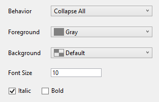

# RegionsWasher
Visual Studio Extension to affect the appearance and behavior of regions.

## Features

* Manipulate the behavior at loading the page:
  * Do nothing
  * Collapse all
  * Expand all
  * Prevent collapsing (region outling is shown but not possible to collapse them)
* Choose the foreground, background, font size and text style

##  Restrictions
* Only available on C# source files.
* VS 2017+ only

## Installation
Build and install the vsix Package or install it from the extensions manager directly from  VS.